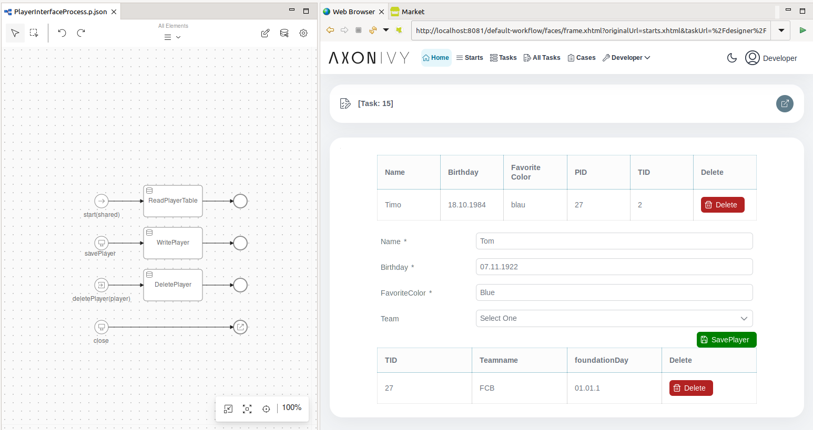

# Datenbank-Demo

Axon Ivy's Datenbank-Demo zeigt, wie man Daten aus Datenbanktabellen erstellt, liest, aktualisiert und löscht. Mit Hilfe von Datenbankaktivitäten kannst Du bestehende Datenbanken perfekt integrieren.

## Demo

